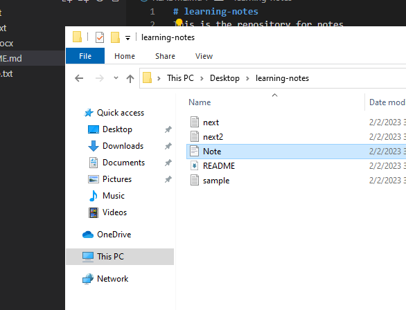

# Living Beings

This page will have information about living beings.

## Plants

For plants

## Animals

For animals we will bold this **letter**.

Animals example:

- Lion
- Tiger
- Elephant

`print('Hello World')`

[GitHub](https://github.com/)

| Name | Category |
| ----------- | ----------- |
| Sparrow | Aves |
| Cow | Mammal |
| Bat | Mammal |
